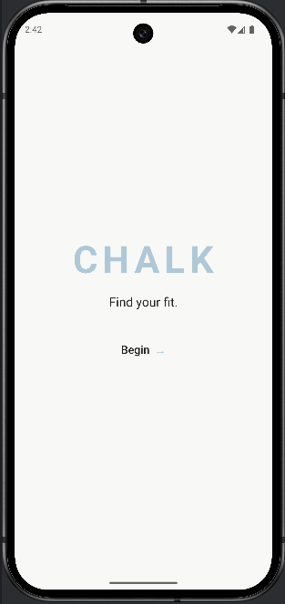
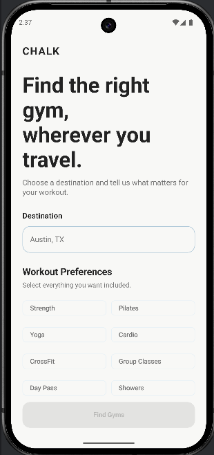
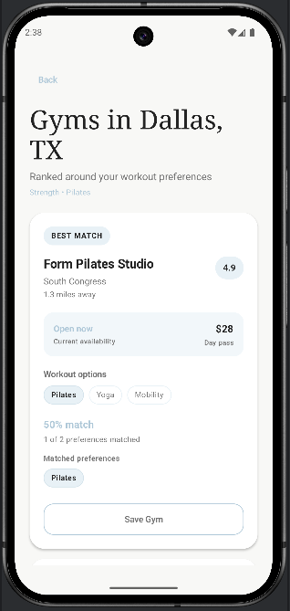
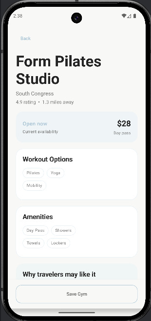
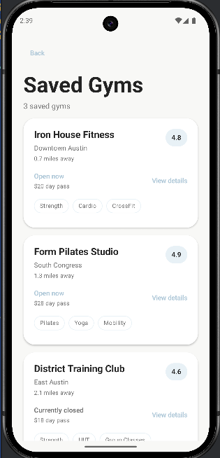

# Chalk

Chalk is a native Android application designed to help travelers locate 
nearby gyms that match their workout preferences in whatever city they are visiting.

Instead of relying on broad map searches, users can narrow their options based on things such as
workout types, day-pass availability, and previously saved gyms.

## Overview

Finding a gym while traveling can often mean searching through scatter reviews, websites, and incomplete
or out-of-date business listings.

Chalk is designed to make that process more intentional by helping the user identify gyms that fit 
their specific workout needs and/or wants, including: 

- Strength Training
- Pilates
- Group Fitness Sessions
- Day-Pass Availability
- Previously Saved Locations

The application prioritizes a focused, traveler-friendly experience rather than functioning as a general-
purpose directory.

## Current Features

- Selected Workout Preferences
- Browse Matching Gym Results, organized in "Best Match" hierarchy
- View Gym Details and Amenities
- Save and Unsave Gyms
- View previously saved gyms
- Navigate between application screens via Jetpack Compose
- Responsive UI, using Compose state management

## Screenshots

### Landing Screen 

### Home Screen/Workout Preferences 

### Gym Results 

### Gym Details

### Saved Gyms

## Technology 

- Kotlin
- Jetpack Compose
- Material 3
- Android Studio
- Gradle
- Git/GitHub

### Architecture

Chalk currently uses a Compose-based interface with screen level 
state management and mock data. 

The application is being developed incrementally, beginning with primary user flows 
before introducing external services and persistent storage. This approach 
allows the interaction design and recommendation experience to be validated 
before adding infrastructure complexity.

## Planned Development

The future of Chalk includes: 

- Google Places API integration
- Location-based gym discovery
- Persistent saved gyms
- More detailed filtering
- Higher ranking for previously saved gyms
- Alternative recommendations when a saved gym no longer matches the user's needs
- Notifications/alerts when gym details or day-pass availability changes

## Product Direction

Chalk is intended for travelers who care about maintaining a specific workout routine while
away from home and those looking to try something new in a city that may be mostly unknown to them.

The long-term goal is to provide recommendations that reflect both the user's current workout requirements 
and their previous gym preferences, creating a more useful experience than simply submitting a generic
nearby search.